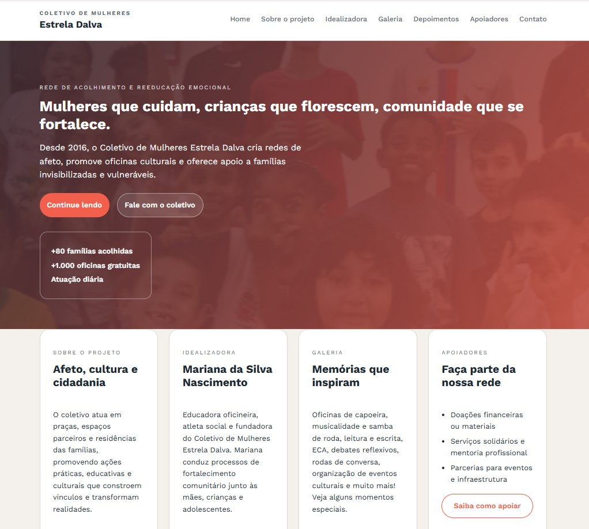

<h1 align="center"> Site Institucional </h1>

Fizemos um site para o nosso Projeto de Extensão da Graduação em Engenharia de Software.  

  <a href="#-tecnologias">Tecnologias</a>&nbsp;&nbsp;&nbsp;|&nbsp;&nbsp;&nbsp;
  <a href="#-projeto">Projeto</a>

 

  

## 🚀 Tecnologias

Esse projeto foi desenvolvido com as seguintes tecnologias:

- HTML e CSS
- Git

## 💻 Projeto

Um site institucional reunindo as informações do Projeto Estrela Dalva.

Desenvolvido por: Artur Neri e Larissa Nakamura.